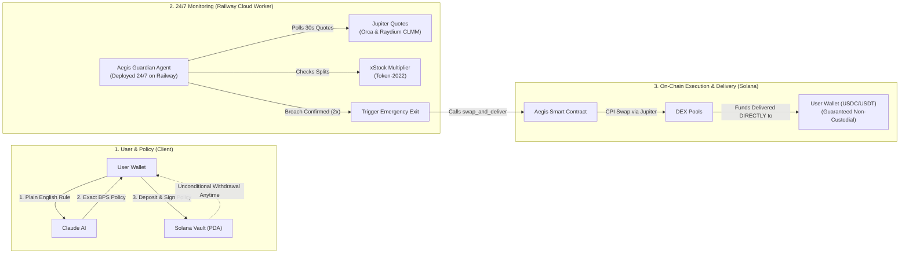

# Aegis

**Non-custodial risk guardian for tokenized stocks on Solana.**
Write your risk limit in plain English. Aegis converts it into an on-chain policy and enforces it on your position — around the clock, without taking custody of your tokens.

---

## What Aegis is

Aegis is a Solana program plus an off-chain guardian agent that lets the owner of a tokenized stock (an xStock — SPYX, QQQx, GLDx, …) set a downside rule and have that rule executed automatically.

You describe the rule in a sentence — _"If SPYX drops more than 8%, exit 75% to USDC with 0.3% max slippage"_ — Claude converts it into numeric policy parameters, and the owner signs that policy on-chain. From then on, an autonomous agent running 24/7 on Railway watches the price. When the rule is breached, the agent calls the program, and the program swaps the specified fraction of the position into a stable asset (USDC, USDT or SOL) **directly into the owner's own token account**.

The agent never takes custody. It can only trigger a swap that the on-chain policy already permits, and the owner can withdraw at any moment regardless of what the agent is doing.

---

## Tech stack

| Layer | Technology |
|---|---|
| Smart contract | Rust + Anchor 0.30.1 (`programs/aegis`) |
| Chain | Solana (`solana-test-validator` 1.18.17 locally) |
| Token standard | SPL Token + Token-2022 (xStock scaled-UI-amount multiplier extension) |
| Swap execution | Jupiter v6 aggregator CPI (`JUP6Lkb…`), routed through Raydium CLMM |
| Price source | Jupiter quotes across Orca Whirlpool **and** Raydium CLMM, with a divergence guard |
| Corporate actions | xStocks multiplier read from the on-chain Token-2022 extension + xStocks API events |
| Policy parsing (AI) | Anthropic Claude — `claude-haiku-4-5` (dashboard), `claude-opus-4-5` (agent package) |
| Frontend | Next.js 15.5 (App Router), React 19, TypeScript 5.7, Solana wallet adapter (Phantom, Solflare), lightweight-charts |
| 24/7 Guardian Agent | Node.js + TypeScript, deployed to Railway as a persistent 24/7 background worker (30s poll loop) |
| Tests | Anchor `ts-mocha` suite (`tests/aegis.ts`), Jest unit tests (`agent-solana/test`) |

---

## System architecture

Aegis is built around three clear, decoupled tiers: **User Policy Setup**, **24/7 Cloud Guardian (Railway)**, and **On-Chain Non-Custodial Execution (Solana)**.



### System at a glance (3-step lifecycle)

1. **Define & Deposit (Client)**: You write your risk limit in plain English (e.g., _"If SPYX drops more than 8%, exit 75% to USDC"_). Claude converts it into exact on-chain parameters. You sign the policy and deposit your tokenized stock into an isolated, non-custodial PDA vault.
2. **24/7 Autonomous Watch (Railway Worker)**: A lightweight Node.js daemon runs 24/7 on Railway. Every 30 seconds, it cross-checks market prices across Orca Whirlpools and Raydium CLMM, checks Token-2022 corporate action multipliers (so splits aren't flagged as crashes), and double-confirms any price breach across two consecutive polling cycles.
3. **Execute & Deliver (Solana Program)**: When a real breach occurs, the Railway agent triggers the on-chain Aegis program. The program validates that the trade strictly satisfies your policy limits, executes the swap via Jupiter CPI, and sends the stablecoin proceeds **directly into your own wallet**. The agent never takes custody of funds, and you can withdraw your position at any second.

---

## How Aegis works

**1. Policy creation (dashboard → Claude → chain)**
The dashboard sends your sentence to `/api/parse-policy`, which calls Claude with a forced JSON tool schema and re-validates the result with Zod. Every basis-point field is clamped to a program-aligned envelope (1–10 000 bps; slippage 1–500 bps), and the response reports which values were read from your sentence versus filled from a documented default, so a default is never presented as your instruction. The owner then signs `set_policy` — the program rejects any call that is not owner-signed.

**2. Custody (program)**
`open_position` moves the tokens into a per-position vault owned by the program. `withdraw` is owner-only and cannot be blocked or delayed by the agent, and no instruction lets the agent choose a recipient.

**3. Monitoring (24/7 Railway agent → Jupiter → risk engine)**
Every 30 s (configurable), the guardian daemon running 24/7 on Railway reads open positions and their policies from chain, then quotes the position's asset-to-target pair **on two venues — Orca Whirlpool and Raydium CLMM**. If the two venues disagree by more than 150 bps the pass is abandoned (circuit breaker), and if either quote is unavailable the position is skipped entirely (fail-closed) rather than acted on.

Prices are normalized by the xStock multiplier before any drawdown maths, so a corporate action that re-prices the token is not mistaken for a crash. Positions inside a corporate-action activation window are suspended proactively.

**4. Trigger (agent → program)**
A breach must be observed on **two consecutive polls** before anything is submitted, which filters single-tick wicks. The agent then calls `swap_and_deliver`, and the program enforces, on-chain:

- the caller is the configured `authorized_agent`;
- the policy is active and the position is not paused;
- `exit_bps ≤ policy.exit_percent_bps` (the agent cannot exit more than you allowed);
- the transfer target must equal `policy.target_mint`;
- minimum output is computed from `policy.max_slippage_bps` (the agent cannot accept more slippage than you set);
- the destination is **derived on-chain** as the owner's associated token account for that mint — it is not a parameter, so there is no arbitrary-recipient path.

**5. Execution and delivery**
The program CPIs into the Jupiter v6 aggregator with the route data supplied by the agent; the swap output lands directly in the owner's token account.

---

## Current environment: cloned mainnet

**Aegis is not deployed to mainnet yet.** It currently runs against a local `solana-test-validator` that **clones live mainnet state**, and the program is deployed to that local validator at `C67pkvsssWAB8j6vPmAfb2WB8uWWiPmkYfqEjK8HaG6L`.

Cloned from mainnet: the Jupiter v6 program and its ProgramData, the Raydium CLMM program and its ProgramData, the SPYX / QQQx / GLDx Token-2022 mints, USDC / USDT / SOL, and the pool and vault accounts the routes touch. The agent still fetches **live** Jupiter quotes over HTTPS.

Practical consequences:

- Nothing here risks real funds, and no swap can reach a real market.
- The ledger is deleted and recreated every time the validator starts (`--reset`), so positions and policies do **not** survive a restart — re-seed and re-create them.
- The clone list is a fixed snapshot. Because live routes reference pool PDAs that move over time, a swap can fail when the current route needs an account that was not cloned. Detection and dispatch still work; the CPI is what fails.
- The test suite (`tests/aegis.ts`) is bound to `http://127.0.0.1:8899` and creates positions, executes swaps and fuzzes invariants. **Run it only against localnet.**

---

## Why this matters for tokenized stocks on Solana

- Tokenized equities trade 24/7 on-chain, while brokerage stop orders only work during market hours — there is no broker-side mechanism watching an xStock position overnight or on a weekend.
- xStocks are Token-2022 tokens whose `scaledUiAmount` multiplier changes on splits and dividends. Because that multiplier re-prices every holder, a 4-for-1 split is arithmetically identical to a 75% crash to any monitor that ignores it. Aegis normalizes by the multiplier before comparing prices.
- Liquidity is concentrated in a small number of CLMM pools, so a single pool can print a distorted price. Cross-checking two venues and refusing to act when they diverge removes the single-bad-quote failure mode.
- A rule that is enforced on-chain cannot be widened by the agent: exit size, slippage ceiling and destination are fixed by the owner and checked by the program at execution time.
- The position stays in a program-owned vault that the owner can withdraw from at any time, so automation does not require handing over custody.

---

## Setup

**Prerequisites:** Rust, Solana CLI, Anchor CLI 0.30.1 (`avm install 0.30.1 && avm use 0.30.1`), Node.js 20+. On Windows, run the validator and its scripts from WSL.

**1. Start the cloned-mainnet validator**

```bash
bash scripts/start_persistent_validator.sh
```

**2. Seed on-chain state** (config PDA, agent/authority, owner token accounts and balances)

```bash
node scripts/init_persistent_validator.cjs
```

**3. Frontend**

```bash
cd frontend
npm install --legacy-peer-deps
npm run dev                 # http://localhost:3000
npm run typecheck           # tsc --noEmit
```

Environment lives in `frontend/.env.local`: `SOLANA_RPC_URL`, `NEXT_PUBLIC_RPC_URL`, `NEXT_PUBLIC_SOLANA_RPC_URL` (all `http://localhost:8899`), the program ID, and `ANTHROPIC_API_KEY`.

**4. 24/7 Monitoring Agent (Railway Deployment & Local Run)**

The guardian agent runs as an autonomous 24/7 daemon that watches DEX prices, checks corporate actions, and triggers emergency liquidation swaps.

#### Option A: Deploy to Railway (Production 24/7 Cloud Worker)

Railway hosts the monitoring agent as a persistent background worker with automatic crash recovery, zero-downtime redeploys, and continuous 24/7 execution even when market hours are closed.

1. **Create Railway Project**:
   - Go to [railway.app](https://railway.app) and create a new project.
   - Choose **Deploy from GitHub repo** and select your `Aegis` repository.

2. **Configure Service Settings**:
   - **Root Directory**: Set to `/agent-solana`.
   - **Build Command**: `npm run build`
   - **Start Command**: `npm start` (or auto-detected via [`agent-solana/Procfile`](file:///agent-solana/Procfile): `worker: npm start`).
   - **Service Type**: Worker service (no public HTTP port required; the agent runs an outbound polling daemon).

3. **Set Environment Variables in Railway**:
   In your Railway project service, add the following variables:

   | Variable | Description | Example / Recommended Value |
   |---|---|---|
   | `SOLANA_RPC_URL` | Solana RPC endpoint | `https://mainnet.helius-rpc.com/?api-key=...` or devnet/localnet URL |
   | `AEGIS_PROGRAM_ID` | Deployed Anchor Program ID | `C67pkvsssWAB8j6vPmAfb2WB8uWWiPmkYfqEjK8HaG6L` |
   | `AGENT_KEYPAIR` | Authorized agent keypair | Raw byte array string `[12,34,56,...]` matching `AegisConfig.agent` |
   | `USDC_MINT` | Target stablecoin mint | `EPjFWdd5AufqSSqeM2qN1xzybapC8G4wEGGkZwyTDt1v` (Solana USDC) |
   | `ANTHROPIC_API_KEY` | Anthropic Claude API key | `sk-ant-...` |
   | `POLL_INTERVAL_MS` | Polling cadence | `30000` (every 30 seconds) |
   | `DRY_RUN` | Live execution toggle | `false` for live on-chain swaps; `true` for dry-run logging |
   | `XSTOCKS_API_BASE` | Corporate actions endpoint | `https://api.xstocks.fi/api/v2` |

4. **Verify Live Operation**:
   - Railway will compile TypeScript (`tsc`) and start `dist/index.js`.
   - In the Railway deployment logs, you will observe the 30-second heartbeat loop fetching live Orca Whirlpool and Raydium CLMM quotes, verifying on-chain policies, and tracking portfolio health.

#### Option B: Run Locally (Development / Localnet)

```bash
cd agent-solana
npm install
npm test                    # Jest unit tests (localnet/RPC-free invariants)
npm run dev                 # start the 30s monitoring loop
```

Environment lives in `agent-solana/.env`. Supported variables match the table above. Note that when the agent is constructed without an explicit `dryRun` option the compiled default is active dispatch, so run in dry mode (`DRY_RUN=true`) explicitly while testing against localnet.

**5. Program**

```bash
anchor build
anchor test                 # localnet only — never point this at mainnet
anchor deploy
```

**6. Trigger the guardian on demand (demo)**

Against real market data a breach cannot be produced on command, so `demo-trigger.ts` drives the same monitor loop and substitutes only the price feed for a scripted drawdown. The position, the on-chain policy, the agent signature and the swap are real.

```bash
cd agent-solana
npm run demo:trigger -- --drop 12 --pause 3000
```

Flags: `--drop <pct>`, `--asset <mint>`, `--entry <usd>`, `--pause <ms>`, `--dry-run`. The script refuses to run against a non-local RPC and prints on every pass that the price feed is scripted.
