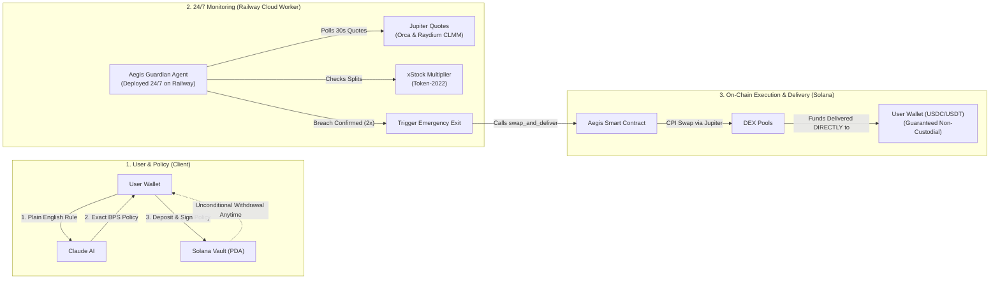
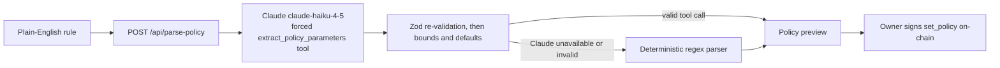
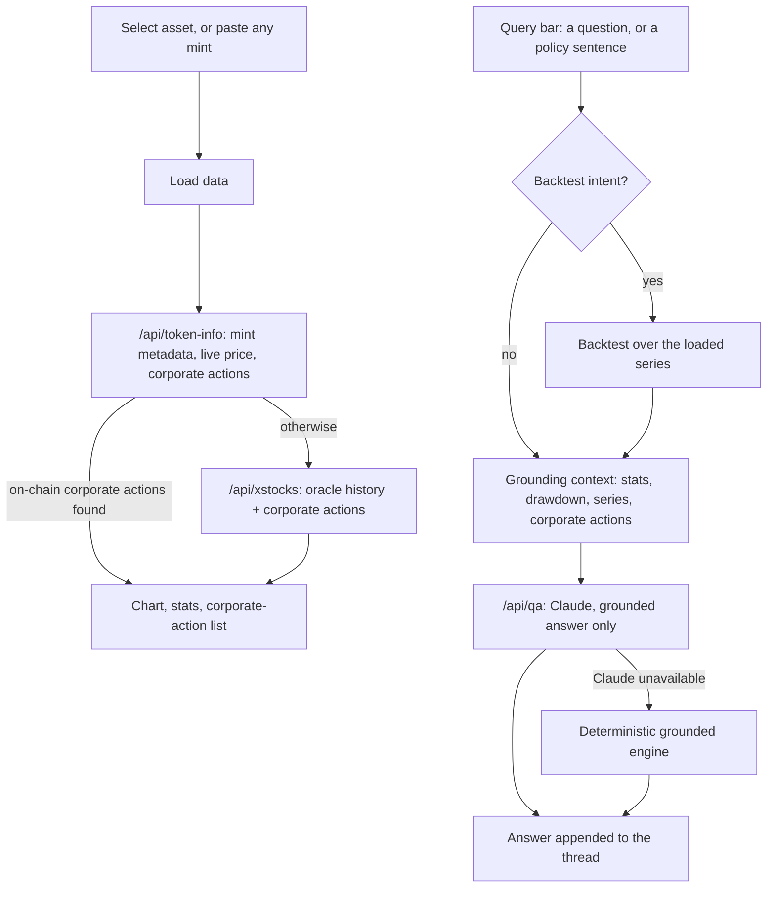

# Aegis

**Non-custodial risk guardian for tokenized stocks on Solana.**
Write your risk limit in plain English. Aegis converts it into an on-chain policy and enforces it on your position — around the clock, without taking custody of your tokens.

---

## What Aegis is

Aegis is a Solana program plus an off-chain guardian agent that lets the owner of a tokenized stock (an xStock — SPYX, QQQx, GLDx, …) set a downside rule and have that rule executed automatically.

You describe the rule in a sentence — _"If SPYX drops more than 8%, exit 75% to USDC with 0.3% max slippage"_ — Claude converts it into numeric policy parameters, and the owner signs that policy on-chain. From then on, an autonomous agent running 24/7 on Railway watches the price. When the rule is breached, the agent calls the program, and the program swaps the specified fraction of the position into a stable asset (USDC, USDT or SOL) **directly into the owner's own token account**.

The agent never takes custody. It can only trigger a swap that the on-chain policy already permits, and the owner can withdraw at any moment regardless of what the agent is doing.

---

## Tech stack & code implementation

### 1. Smart contract & on-chain state machine (Rust + Anchor 0.30.1)
- **Technology**: Rust, Anchor Framework 0.30.1, Solana Program SDK.
- **Where it is used in code**:
  - [`programs/aegis/src/lib.rs`](https://github.com/Ultraviolet01/Aegis_bot/blob/main/programs/aegis/src/lib.rs): Program entrypoint, instruction dispatching, and security constraints (`initialize`, `open_position`, `set_policy`, `withdraw`, `swap_and_deliver`).
  - [`programs/aegis/src/state.rs`](https://github.com/Ultraviolet01/Aegis_bot/blob/main/programs/aegis/src/state.rs): On-chain PDA account schemas (`AegisConfig`, `Position`, `Policy`, `OracleConfig`).
  - [`programs/aegis/src/errors.rs`](https://github.com/Ultraviolet01/Aegis_bot/blob/main/programs/aegis/src/errors.rs): Custom error codes enforcing ownership, breach validity, and slippage protections.
  - [`programs/aegis/Cargo.toml`](https://github.com/Ultraviolet01/Aegis_bot/blob/main/programs/aegis/Cargo.toml) and [`Anchor.toml`](https://github.com/Ultraviolet01/Aegis_bot/blob/main/Anchor.toml): Package configuration, dependency declarations, and Anchor workspace wiring.

### 2. Blockchain runtime & localnet environment (Solana CLI & Cloned Validator)
- **Technology**: Solana runtime (`solana-test-validator` 1.18.17) with mainnet account cloning.
- **Where it is used in code**:
  - [`scripts/start_persistent_validator.sh`](https://github.com/Ultraviolet01/Aegis_bot/blob/main/scripts/start_persistent_validator.sh): Spawns the local test validator cloning live mainnet programs (Jupiter v6 and Raydium CLMM) and mint accounts (SPYX, QQQx, GLDx, USDC, USDT).
  - [`scripts/init_persistent_validator.cjs`](https://github.com/Ultraviolet01/Aegis_bot/blob/main/scripts/init_persistent_validator.cjs): Seeds the local blockchain state, initializes the `AegisConfig` PDA, configures agent authorization, and funds demo wallets.

### 3. Token standards & corporate action normalization (SPL Token & Token-2022)
- **Technology**: Solana Token Program, Token-2022 (`spl-token-2022`), `scaledUiAmount` / `InterestBearing` extensions.
- **Where it is used in code**:
  - [`programs/aegis/src/token2022.rs`](https://github.com/Ultraviolet01/Aegis_bot/blob/main/programs/aegis/src/token2022.rs): On-chain CPI helpers for Token-2022 vault transfers and multiplier inspection.
  - [`agent-solana/src/xstocks/onchain.ts`](https://github.com/Ultraviolet01/Aegis_bot/blob/main/agent-solana/src/xstocks/onchain.ts): Parses Token-2022 mint accounts directly from chain to extract split multipliers.
  - [`agent-solana/src/xstocks/multiplier.ts`](https://github.com/Ultraviolet01/Aegis_bot/blob/main/agent-solana/src/xstocks/multiplier.ts): Normalizes stock prices against corporate action multipliers before drawdown calculations.
  - [`frontend/app/api/token-info/route.ts`](https://github.com/Ultraviolet01/Aegis_bot/blob/main/frontend/app/api/token-info/route.ts): Inspects arbitrary on-chain mints to determine standard (SPL vs Token-2022) and corporate action metadata.

### 4. Non-custodial DEX execution (Jupiter v6 Aggregator CPI & Raydium CLMM)
- **Technology**: Jupiter v6 Swap Aggregator, Solana Cross-Program Invocation (CPI), Raydium Concentrated Liquidity (CLMM).
- **Where it is used in code**:
  - [`programs/aegis/src/jupiter_cpi.rs`](https://github.com/Ultraviolet01/Aegis_bot/blob/main/programs/aegis/src/jupiter_cpi.rs): Encapsulates low-level `invoke_signed` CPI into Jupiter v6 (`JUP6LkbZbjS1jKKwapdHNy74zcZ3tLUZoi5QNyVTaV4`).
  - [`programs/aegis/src/lib.rs`](https://github.com/Ultraviolet01/Aegis_bot/blob/main/programs/aegis/src/lib.rs): Validates execution invariants in `swap_and_deliver` and delivers swapped funds directly to the user's Associated Token Account (ATA).
  - [`agent-solana/src/dispatcher/executor.ts`](https://github.com/Ultraviolet01/Aegis_bot/blob/main/agent-solana/src/dispatcher/executor.ts): Fetches executable route transactions from Jupiter API and dispatches them signed by the authorized agent keypair.

### 5. Multi-venue pricing & circuit breaker (Orca Whirlpools & Raydium CLMM)
- **Technology**: Jupiter Quote API, Orca Whirlpool AMM, Raydium CLMM.
- **Where it is used in code**:
  - [`agent-solana/src/price/multiPool.ts`](https://github.com/Ultraviolet01/Aegis_bot/blob/main/agent-solana/src/price/multiPool.ts): Queries live swap quotes simultaneously on Orca and Raydium; trips a circuit breaker if spread exceeds 150 bps.
  - [`agent-solana/src/risk/engine.ts`](https://github.com/Ultraviolet01/Aegis_bot/blob/main/agent-solana/src/risk/engine.ts): Evaluates position prices against on-chain policies and enforces a 2-poll consecutive breach confirmation.
  - [`frontend/app/api/pool-spread/route.ts`](https://github.com/Ultraviolet01/Aegis_bot/blob/main/frontend/app/api/pool-spread/route.ts): Exposes real-time Orca vs Raydium spread metrics to the dashboard UI.

### 6. Corporate actions tracking & oracle feeds (xStocks API & Oracles)
- **Technology**: xStocks Public REST API v2, Pyth & Switchboard feeds.
- **Where it is used in code**:
  - [`agent-solana/src/xstocks/client.ts`](https://github.com/Ultraviolet01/Aegis_bot/blob/main/agent-solana/src/xstocks/client.ts): Fetches scheduled split and dividend dates to pause guardian actions during split windows.
  - [`frontend/app/api/xstocks/[...path]/route.ts`](https://github.com/Ultraviolet01/Aegis_bot/blob/main/frontend/app/api/xstocks/%5B...path%5D/route.ts): Serverless proxy routing oracle price histories and corporate actions to avoid CORS restrictions.
  - [`frontend/app/app/history/page.tsx`](https://github.com/Ultraviolet01/Aegis_bot/blob/main/frontend/app/app/history/page.tsx): Loads official historical price series and plots corporate action events.

### 7. Natural language risk policy parsing & grounded AI (Anthropic Claude)
- **Technology**: Anthropic Messages API (`claude-haiku-4-5`), Zod schema validation.
- **Where it is used in code**:
  - [`frontend/app/api/parse-policy/route.ts`](https://github.com/Ultraviolet01/Aegis_bot/blob/main/frontend/app/api/parse-policy/route.ts): Translates natural language risk rules into validated basis points via tool-calling (`extract_policy_parameters`).
  - [`frontend/lib/policy.ts`](https://github.com/Ultraviolet01/Aegis_bot/blob/main/frontend/lib/policy.ts): Deterministic regex fallback parser used when AI is offline or returns invalid structure.
  - [`frontend/app/api/qa/route.ts`](https://github.com/Ultraviolet01/Aegis_bot/blob/main/frontend/app/api/qa/route.ts): Grounded Q&A engine that answers historical drawdown questions exclusively from loaded data.
  - [`agent-solana/src/policy/parser.ts`](https://github.com/Ultraviolet01/Aegis_bot/blob/main/agent-solana/src/policy/parser.ts): Agent-side policy parser support.

### 8. Web application & interactive user dashboard (Next.js 15, React 19 & TypeScript 5)
- **Technology**: Next.js 15.5 App Router, React 19, TypeScript 5.7, Tailwind CSS / Vanilla CSS.
- **Where it is used in code**:
  - [`frontend/app/layout.tsx`](https://github.com/Ultraviolet01/Aegis_bot/blob/main/frontend/app/layout.tsx) & [`frontend/app/globals.css`](https://github.com/Ultraviolet01/Aegis_bot/blob/main/frontend/app/globals.css): Global layout, typography, and styling tokens.
  - [`frontend/app/page.tsx`](https://github.com/Ultraviolet01/Aegis_bot/blob/main/frontend/app/page.tsx): Main product landing page and feature walkthrough.
  - [`frontend/app/app/page.tsx`](https://github.com/Ultraviolet01/Aegis_bot/blob/main/frontend/app/app/page.tsx): Core guardian dashboard showing live positions, multi-pool sanity indicators, and policy drawer.
  - [`frontend/app/app/history/page.tsx`](https://github.com/Ultraviolet01/Aegis_bot/blob/main/frontend/app/app/history/page.tsx): Historical oracle explorer, backtesting console, and provenance indicators.
  - [`frontend/package.json`](https://github.com/Ultraviolet01/Aegis_bot/blob/main/frontend/package.json): Frontend dependencies and build scripts.

### 9. Client wallet integration & non-custodial signing (Solana Wallet Adapter)
- **Technology**: `@solana/wallet-adapter-react`, `@solana/wallet-adapter-react-ui`, `@solana/web3.js`.
- **Where it is used in code**:
  - [`frontend/components/WalletProvider.tsx`](https://github.com/Ultraviolet01/Aegis_bot/blob/main/frontend/components/WalletProvider.tsx): Wraps the application with Phantom, Solflare, and standard Solana wallet providers.
  - [`frontend/app/api/deposit/route.ts`](https://github.com/Ultraviolet01/Aegis_bot/blob/main/frontend/app/api/deposit/route.ts): Builds unsigned `open_position` + `set_policy` transactions returned to the browser for user signing.
  - [`frontend/app/api/withdraw/route.ts`](https://github.com/Ultraviolet01/Aegis_bot/blob/main/frontend/app/api/withdraw/route.ts): Builds unsigned `withdraw` transactions ensuring only the owner can unlock vault funds.

### 10. Financial charting & series visualization (TradingView Lightweight Charts)
- **Technology**: `lightweight-charts` (v4).
- **Where it is used in code**:
  - [`frontend/components/price-chart.tsx`](https://github.com/Ultraviolet01/Aegis_bot/blob/main/frontend/components/price-chart.tsx): Interactive financial chart component rendering candlesticks, area series, and corporate action markers.
  - [`frontend/app/app/history/page.tsx`](https://github.com/Ultraviolet01/Aegis_bot/blob/main/frontend/app/app/history/page.tsx): Ingests time-series datasets into the chart and coordinates backtest visual overlays.

### 11. Autonomous 24/7 guardian service (Node.js, TypeScript & Railway)
- **Technology**: Node.js 20+, TypeScript, Railway PaaS background worker.
- **Where it is used in code**:
  - [`agent-solana/src/index.ts`](https://github.com/Ultraviolet01/Aegis_bot/blob/main/agent-solana/src/index.ts): Main daemon loop and signal handling (`SIGINT`, `SIGTERM`).
  - [`agent-solana/src/monitor.ts`](https://github.com/Ultraviolet01/Aegis_bot/blob/main/agent-solana/src/monitor.ts): 30-second polling orchestrator reading on-chain accounts and coordinating price checks.
  - [`agent-solana/src/demo-trigger.ts`](https://github.com/Ultraviolet01/Aegis_bot/blob/main/agent-solana/src/demo-trigger.ts): CLI test runner for injecting simulated drawdowns against real on-chain positions.
  - [`agent-solana/Procfile`](https://github.com/Ultraviolet01/Aegis_bot/blob/main/agent-solana/Procfile) & [`agent-solana/package.json`](https://github.com/Ultraviolet01/Aegis_bot/blob/main/agent-solana/package.json): Railway worker deployment configuration (`worker: npm start`).

### 12. Automated testing & quality assurance (Anchor ts-mocha & Jest)
- **Technology**: Anchor Test Harness, Mocha, Chai, Jest.
- **Where it is used in code**:
  - [`tests/aegis.ts`](https://github.com/Ultraviolet01/Aegis_bot/blob/main/tests/aegis.ts): End-to-end integration tests verifying vault creation, policy limits, unauthorized caller rejection, and Jupiter swaps.
  - [`agent-solana/test/policy/parser.test.ts`](https://github.com/Ultraviolet01/Aegis_bot/blob/main/agent-solana/test/policy/parser.test.ts): Unit tests verifying policy extraction and parameter bounds.
  - [`agent-solana/test/risk/engine.test.ts`](https://github.com/Ultraviolet01/Aegis_bot/blob/main/agent-solana/test/risk/engine.test.ts): Tests evaluating drawdown breaches, circuit breakers, and 2-poll confirmations.
  - [`agent-solana/test/xstocks/multiplier.test.ts`](https://github.com/Ultraviolet01/Aegis_bot/blob/main/agent-solana/test/xstocks/multiplier.test.ts): Validates arithmetic normalization across stock splits and reverse splits.

---

## System architecture

Aegis is built around three clear, decoupled tiers: **User Policy Setup**, **24/7 Cloud Guardian (Railway)**, and **On-Chain Non-Custodial Execution (Solana)**.



### System at a glance (3-step lifecycle)

1. **Define & Deposit (Client)**: You write your risk limit in plain English (e.g., _"If SPYX drops more than 8%, exit 75% to USDC"_). Claude converts it into exact on-chain parameters. You sign the policy and deposit your tokenized stock into an isolated, non-custodial PDA vault.
2. **24/7 Autonomous Watch (Railway Worker)**: A lightweight Node.js daemon runs 24/7 on Railway. Every 30 seconds, it cross-checks market prices across Orca Whirlpools and Raydium CLMM, checks Token-2022 corporate action multipliers (so splits aren't flagged as crashes), and double-confirms any price breach across two consecutive polling cycles.
3. **Execute & Deliver (Solana Program)**: When a real breach occurs, the Railway agent triggers the on-chain Aegis program. The program validates that the trade strictly satisfies your policy limits, executes the swap via Jupiter CPI, and sends the stablecoin proceeds **directly into your own wallet**. The agent never takes custody of funds, and you can withdraw your position at any second.

---

## How Aegis works

**1. Policy creation (dashboard → Claude → chain)**
The dashboard sends your sentence to `/api/parse-policy`, which calls Claude with a forced JSON tool schema and re-validates the result with Zod. Every basis-point field is clamped to a program-aligned envelope (1–10 000 bps; slippage 1–500 bps), and the response reports which values were read from your sentence versus filled from a documented default, so a default is never presented as your instruction. The owner then signs `set_policy` — the program rejects any call that is not owner-signed.

**2. Custody (program)**
`open_position` moves the tokens into a per-position vault owned by the program. `withdraw` is owner-only and cannot be blocked or delayed by the agent, and no instruction lets the agent choose a recipient.

**3. Monitoring (24/7 Railway agent → Jupiter → risk engine)**
Every 30 s (configurable), the guardian daemon running 24/7 on Railway reads open positions and their policies from chain, then quotes the position's asset-to-target pair **on two venues — Orca Whirlpool and Raydium CLMM**. If the two venues disagree by more than 150 bps the pass is abandoned (circuit breaker), and if either quote is unavailable the position is skipped entirely (fail-closed) rather than acted on.

Prices are normalized by the xStock multiplier before any drawdown maths, so a corporate action that re-prices the token is not mistaken for a crash. Positions inside a corporate-action activation window are suspended proactively.

**4. Trigger (agent → program)**
A breach must be observed on **two consecutive polls** before anything is submitted, which filters single-tick wicks. The agent then calls `swap_and_deliver`, and the program enforces, on-chain:

- the caller is the configured `authorized_agent`;
- the policy is active and the position is not paused;
- `exit_bps ≤ policy.exit_percent_bps` (the agent cannot exit more than you allowed);
- the transfer target must equal `policy.target_mint`;
- minimum output is computed from `policy.max_slippage_bps` (the agent cannot accept more slippage than you set);
- the destination is **derived on-chain** as the owner's associated token account for that mint — it is not a parameter, so there is no arbitrary-recipient path.

**5. Execution and delivery**
The program CPIs into the Jupiter v6 aggregator with the route data supplied by the agent; the swap output lands directly in the owner's token account.

---

## Policy parsing flow (dashboard)



1. The owner types the rule in the dashboard composer and submits it. `parseNLPolicy` posts `{ policyText }` to `/api/parse-policy`.
2. The route rejects a malformed body with 400, then calls the Anthropic Messages API with model `claude-haiku-4-5`, a single tool named `extract_policy_parameters`, and `tool_choice` pinned to that tool, so the response is a structured object rather than prose. The schema asks for drawdown, oracle deviation, exit percentage, max slippage, target asset, mode, a plain-English interpretation, a confidence score, and `inferredFields` — the list of values the model filled from a default instead of reading from the sentence.
3. The tool payload is re-validated with Zod. Validation is tolerant of presentation (numeric strings, lower-cased modes, aliased field names) but nothing outside the schema survives.
4. `boundBps` forces each basis-point field into the program envelope (drawdown ≥ 1%, deviation ≥ 0.1%, exit ≥ 0.01%, all ≤ 100%); slippage is clamped to 1–500 bps. Defaulted and clamped fields are collected separately, and the two fields whose absence can be proven from the text alone — slippage and target asset — are added to the defaulted set regardless of what the model claimed, so a default can never be shown as an instruction.
5. The preview card renders the source (Claude, or the regex parser when Claude was unavailable), each field with a "Defaulted — not in your sentence" or "Clamped to limit" marker, the itemised warnings, and advisories such as a conservative slippage cap applied to a large exit.
6. Nothing is signed by the model. The owner approves the parameters and signs `set_policy`; the program checks `has_one = owner` and rejects any other signer.

Fallback: if the API key is missing, Claude errors, or the payload fails validation, the route returns the deterministic parser's result (`lib/policy.ts`) with `source: 'deterministic'` and a stated reason, and the UI badges it as "Regex parser" rather than presenting it as a model result.

---

## Query and History flow (History tab)



**Loading.** The tab resolves the selected asset by mint: listed tickers come from the local catalogue, and anything else is resolved by pasting a mint address into the selector, which calls `/api/token-info` (on-chain mint metadata, Token-2022 vs SPL, multiplier, Jupiter price, and corporate actions). SPYX is loaded from the public xStocks v2 endpoints (price data and multiplier history). Otherwise the xStocks assets and oracle-history endpoints are used. If the oracle history cannot be fetched, the chart falls back to a generated daily series derived from the live price and the hardcoded catalogue values, and the UI shows a warning that the price history is simulated.

**Stats.** Entry, latest, high, low, coverage dates and the maximum drawdown (with its peak and trough) are all computed in the browser from the loaded series, so every figure in the panel and in the answers below is derived from the same data the chart shows.

**Ask and backtest.** One input handles both. The text is classified by intent first:

- **Backtest** (`backtest:`/`policy:` prefixes, "if it drops … exit …", or "exit N% to"): the sentence is sent to the same `/api/parse-policy` route used by the dashboard, and the returned parameters are walked over the loaded series — entry price is the first point, drawdown is measured against it, per-step oracle deviation is measured against the previous point, and any point within 24 hours of a corporate action is skipped so a split is not counted as a breach. The walk stops at the first drawdown breach and reports each trigger, or states that the policy would not have triggered.
- **Question**: the client builds a grounding context from the loaded series only — ticker, point count, entry/latest/high/low with dates, coverage window, max drawdown with its peak and trough, the full daily normalized series, and the corporate-action list with multiplier transitions — and posts it to `/api/qa` together with the parsed stats and any backtest summary.

`/api/qa` calls Claude `claude-haiku-4-5-20251001` with a system prompt that forbids using training knowledge: it must answer only from the supplied context, must use the supplied drawdown peak and trough rather than the overall high and low, and must say when the data cannot answer the question. If the model is unavailable the route falls back to a deterministic engine that answers from the same stats by intent (range, drawdown, corporate actions, latest price), refuses cross-ticker comparisons because the context covers one ticker, and returns `source: 'grounded-engine'`. Either way the answer is appended to the query thread with any backtest result attached.

Both paths compute over the series that is actually loaded — including the fallback series — so a simulated chart produces correspondingly simulated drawdown and backtest numbers.

---

## Current environment: cloned mainnet

**Aegis is not deployed to mainnet yet.** It currently runs against a local `solana-test-validator` that **clones live mainnet state**, and the program is deployed to that local validator at `C67pkvsssWAB8j6vPmAfb2WB8uWWiPmkYfqEjK8HaG6L`.

Cloned from mainnet: the Jupiter v6 program and its ProgramData, the Raydium CLMM program and its ProgramData, the SPYX / QQQx / GLDx Token-2022 mints, USDC / USDT / SOL, and the pool and vault accounts the routes touch. The agent still fetches **live** Jupiter quotes over HTTPS.

Practical consequences:

- Nothing here risks real funds, and no swap can reach a real market.
- The ledger is deleted and recreated every time the validator starts (`--reset`), so positions and policies do **not** survive a restart — re-seed and re-create them.
- The clone list is a fixed snapshot. Because live routes reference pool PDAs that move over time, a swap can fail when the current route needs an account that was not cloned. Detection and dispatch still work; the CPI is what fails.
- The test suite (`tests/aegis.ts`) is bound to `http://127.0.0.1:8899` and creates positions, executes swaps and fuzzes invariants. **Run it only against localnet.**

---

## Why this matters for tokenized stocks on Solana

- Tokenized equities trade 24/7 on-chain, while brokerage stop orders only work during market hours — there is no broker-side mechanism watching an xStock position overnight or on a weekend.
- xStocks are Token-2022 tokens whose `scaledUiAmount` multiplier changes on splits and dividends. Because that multiplier re-prices every holder, a 4-for-1 split is arithmetically identical to a 75% crash to any monitor that ignores it. Aegis normalizes by the multiplier before comparing prices.
- Liquidity is concentrated in a small number of CLMM pools, so a single pool can print a distorted price. Cross-checking two venues and refusing to act when they diverge removes the single-bad-quote failure mode.
- A rule that is enforced on-chain cannot be widened by the agent: exit size, slippage ceiling and destination are fixed by the owner and checked by the program at execution time.
- The position stays in a program-owned vault that the owner can withdraw from at any time, so automation does not require handing over custody.

---

## Setup

**Prerequisites:** Rust, Solana CLI, Anchor CLI 0.30.1 (`avm install 0.30.1 && avm use 0.30.1`), Node.js 20+. On Windows, run the validator and its scripts from WSL.

**1. Start the cloned-mainnet validator**

```bash
bash scripts/start_persistent_validator.sh
```

**2. Seed on-chain state** (config PDA, agent/authority, owner token accounts and balances)

```bash
node scripts/init_persistent_validator.cjs
```

**3. Frontend**

```bash
cd frontend
npm install --legacy-peer-deps
npm run dev                 # http://localhost:3000
npm run typecheck           # tsc --noEmit
```

Environment lives in `frontend/.env.local`: `SOLANA_RPC_URL`, `NEXT_PUBLIC_RPC_URL`, `NEXT_PUBLIC_SOLANA_RPC_URL` (all `http://localhost:8899`), the program ID, and `ANTHROPIC_API_KEY`.

**4. 24/7 Monitoring Agent (Railway Deployment & Local Run)**

The guardian agent runs as an autonomous 24/7 daemon that watches DEX prices, checks corporate actions, and triggers emergency liquidation swaps.

#### Option A: Deploy to Railway (Production 24/7 Cloud Worker)

Railway hosts the monitoring agent as a persistent background worker with automatic crash recovery, zero-downtime redeploys, and continuous 24/7 execution even when market hours are closed.

1. **Create Railway Project**:
   - Go to [railway.app](https://railway.app) and create a new project.
   - Choose **Deploy from GitHub repo** and select your `Aegis` repository.

2. **Configure Service Settings**:
   - **Root Directory**: Set to `/agent-solana`.
   - **Build Command**: `npm run build`
   - **Start Command**: `npm start` (or auto-detected via [`agent-solana/Procfile`](file:///agent-solana/Procfile): `worker: npm start`).
   - **Service Type**: Worker service (no public HTTP port required; the agent runs an outbound polling daemon).

3. **Set Environment Variables in Railway**:
   In your Railway project service, add the following variables:

   | Variable | Description | Example / Recommended Value |
   |---|---|---|
   | `SOLANA_RPC_URL` | Solana RPC endpoint | `https://mainnet.helius-rpc.com/?api-key=...` or devnet/localnet URL |
   | `AEGIS_PROGRAM_ID` | Deployed Anchor Program ID | `C67pkvsssWAB8j6vPmAfb2WB8uWWiPmkYfqEjK8HaG6L` |
   | `AGENT_KEYPAIR` | Authorized agent keypair | Raw byte array string `[12,34,56,...]` matching `AegisConfig.agent` |
   | `USDC_MINT` | Target stablecoin mint | `EPjFWdd5AufqSSqeM2qN1xzybapC8G4wEGGkZwyTDt1v` (Solana USDC) |
   | `ANTHROPIC_API_KEY` | Anthropic Claude API key | `sk-ant-...` |
   | `POLL_INTERVAL_MS` | Polling cadence | `30000` (every 30 seconds) |
   | `DRY_RUN` | Live execution toggle | `false` for live on-chain swaps; `true` for dry-run logging |
   | `XSTOCKS_API_BASE` | Corporate actions endpoint | `https://api.xstocks.fi/api/v2` |

4. **Verify Live Operation**:
   - Railway will compile TypeScript (`tsc`) and start `dist/index.js`.
   - In the Railway deployment logs, you will observe the 30-second heartbeat loop fetching live Orca Whirlpool and Raydium CLMM quotes, verifying on-chain policies, and tracking portfolio health.

#### Option B: Run Locally (Development / Localnet)

```bash
cd agent-solana
npm install
npm test                    # Jest unit tests (localnet/RPC-free invariants)
npm run dev                 # start the 30s monitoring loop
```

Environment lives in `agent-solana/.env`. Supported variables match the table above. Note that when the agent is constructed without an explicit `dryRun` option the compiled default is active dispatch, so run in dry mode (`DRY_RUN=true`) explicitly while testing against localnet.

**5. Program**

```bash
anchor build
anchor test                 # localnet only — never point this at mainnet
anchor deploy
```

**6. Trigger the guardian on demand (demo)**

Against real market data a breach cannot be produced on command, so `demo-trigger.ts` drives the same monitor loop and substitutes only the price feed for a scripted drawdown. The position, the on-chain policy, the agent signature and the swap are real.

```bash
cd agent-solana
npm run demo:trigger -- --drop 12 --pause 3000
```

Flags: `--drop <pct>`, `--asset <mint>`, `--entry <usd>`, `--pause <ms>`, `--dry-run`. The script refuses to run against a non-local RPC and prints on every pass that the price feed is scripted.
